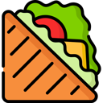

```admonish warning "Work in Progress"
This page is a work in progress! Some information may be incomplete or outdated.
```
```admonish info "Making contributions"
If you would like to make contributions to this documentation site, it's hosted fully open source on GitHub and you can make an edit to any page using the button in the top right. Check out our [Guide to Editing Docs](en/meta/guide-to-editing-docs.md) page for more information.
```

## Getting Started

- [:question: How do I code?](en/general-development/setup/howdoicode.md)
- [:package: Setting up the Dev Environment](en/general-development/setup/setting-up-a-development-environment.md)
- [:chart_with_upwards_trend: Git for the SS14 Developer](en/general-development/setup/git-for-the-ss14-developer.md)


### What should I work on?

* Talk to current developers in Discord.
* Check [the roadmap](https://trello.com/b/vNj28tK2/sandwichstation) for anything you can work on.

### What repositories are part of Space Station 14?
* [SandwichStation](https://github.com/SandwichStation/SandwichStation) is the main codebase. It has the most priority issues.

#### There are other repositories that do not have as many priority issues to work on. If you are still curious about them, they are here:
* [SandwichStation Docker](https://github.com/SandwichStation/SandwichStation-Docker) is the backend container running our server.
* [SandwichStation Wiki](https://github.com/SandwichStation/wiki) this is the crew wiki.
* [SandwichStation Docs](https://github.com/SandwichStation/docs) this is the page your currently reading :wave:
